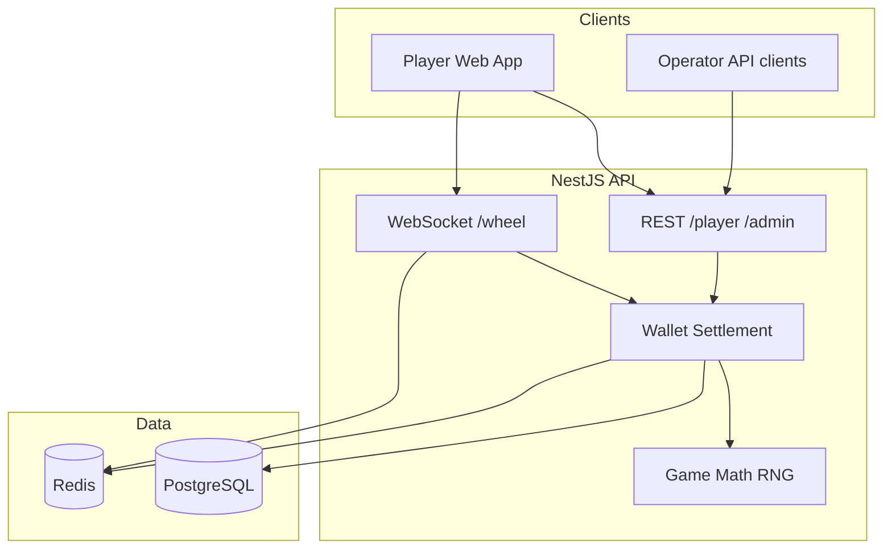

# spinyWheely

iGaming monorepo — **backend** (NestJS operator API) and **frontend** (React player client), orchestrated with npm workspaces.

## Architecture



Full diagrams (sequence flows, module map, scaling): **[docs/ARCHITECTURE.md](docs/ARCHITECTURE.md)**

| Package | Docs |
|---------|------|
| Backend API | [backend/README.md](backend/README.md) |
| Player client | [frontend/README.md](frontend/README.md) |
| Tests | [tests/README.md](tests/README.md) |
| Scaling / K8s | [deploy/SCALING.md](deploy/SCALING.md) |

## Repository layout

```
spiny-wheely/
├── backend/              # @spiny-wheely/backend — NestJS API
├── frontend/             # @spiny-wheely/frontend — React + Vite
├── tests/                # Unit, API, e2e, load tests
├── docs/                 # Architecture diagrams
├── deploy/               # Docker nginx, K8s manifests, deploy scripts
├── docker-compose.yml    # PostgreSQL + Redis
└── docker-compose.scale.yml  # Multi-instance API POC
```

## Quick start

```bash
docker compose up -d
npm install
cp backend/.env.example backend/.env
npm run migration:run
npm run dev
```

| Service | URL |
|---------|-----|
| Client | http://localhost:5173 |
| API | http://localhost:3000 |
| Wheel WS | ws://localhost:3000/wheel |

## Test accounts

| Role | Email | Password |
|------|-------|----------|
| Player | `player@spinywheely.test` | `player123` |
| Operator | `admin@spinywheely.test` | `admin123` |

## Scripts

| Command | Description |
|---------|-------------|
| `npm run dev` | Backend + frontend |
| `npm run build` | Build both packages |
| `npm run migration:run` | Database migrations |
| `npm run test` | Full test suite |
| `npm run test:load:heavy` | Load / stress test |
| `npm run scale:up` | 3 API replicas + nginx on :8080 |
| `npm run k8s:deploy` | Deploy to Kubernetes |
