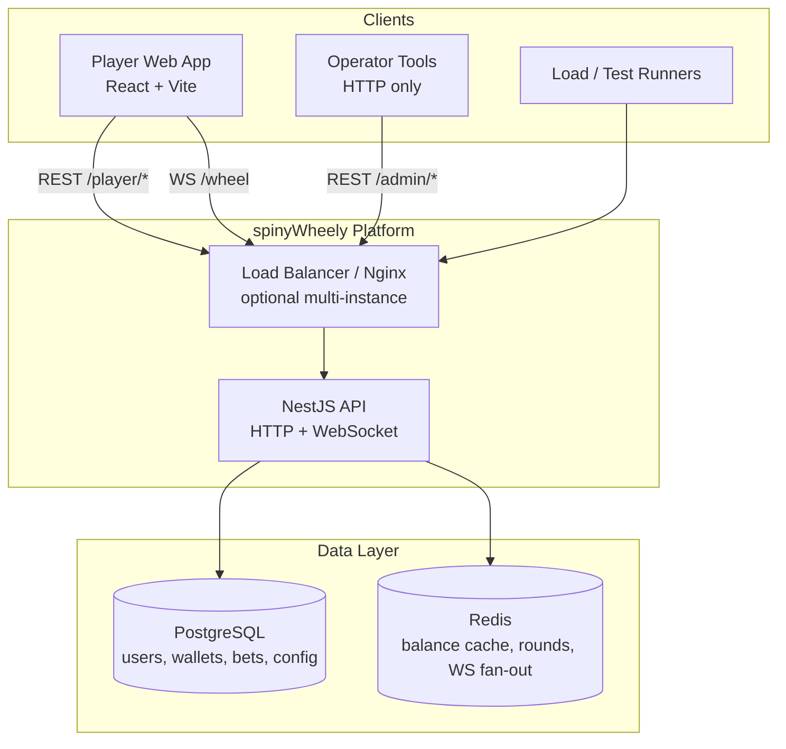
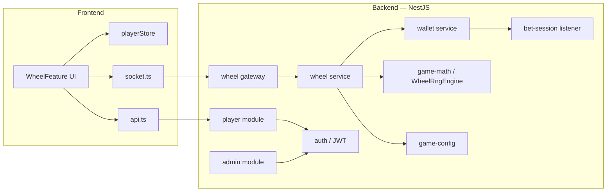
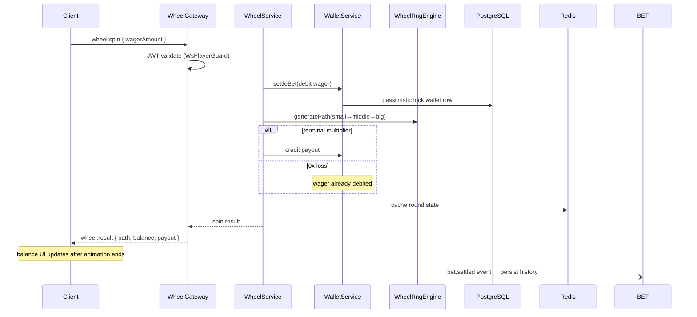

# spinyWheely — System Architecture

High-level design for the iGaming wheel platform. Package-specific details live in [backend/README.md](../backend/README.md) and [frontend/README.md](../frontend/README.md).

## Context diagram

## Component diagram

## Wheel spin sequence

Server-authoritative: the client only animates; outcomes and balance come from the API.

## Backend module map

| Module | Path | Responsibility |
|--------|------|----------------|
| **player** | `backend/src/player/` | Login, profile, wager history |
| **admin** | `backend/src/admin/` | Operator login, RTP metrics, game config |
| **games/wheel** | `backend/src/games/wheel/` | WebSocket gateway, spin orchestration |
| **game-math** | `backend/src/game-math/wheel/` | Pure RNG, segment tables, house edge |
| **wallet** | `backend/src/wallet/` | Balance read/write, settlement, domain events |
| **bet-session** | `backend/src/bet-session/` | Async persistence of settled wagers |
| **game-config** | `backend/src/game-config/` | Per-game RTP, volatility, live flag |
| **auth** | `backend/src/auth/` | JWT issuance, HTTP + WS guards |
| **database** | `backend/src/database/` | TypeORM entities, migrations |
| **redis** | `backend/src/redis/` | Cache, Socket.IO adapter for scaling |
| **health** | `backend/src/health/` | Readiness (DB + Redis) |

## Frontend structure

| Area | Path | Responsibility |
|------|------|----------------|
| **features/wheel** | `frontend/src/features/wheel/` | Wheel UI, tier animation, bet panel |
| **core/store** | `frontend/src/core/store/` | Zustand player state (balance, wager, round) |
| **core/network** | `frontend/src/core/network/` | REST client, Socket.IO wheel client |
| **shared** | `frontend/src/shared/` | Global styles |

## Multi-instance scaling

When running multiple API replicas (Docker Compose scale or Kubernetes), WebSocket rooms are synchronized via the **Socket.IO Redis adapter**. HTTP traffic is load-balanced; each replica shares Postgres and Redis.

See [deploy/SCALING.md](../deploy/SCALING.md) for deployment details.

## Key design decisions

1. **Server-authoritative outcomes** — RNG runs only on the backend; the client never computes payouts.
2. **Pessimistic wallet locking** — one spin per wallet at a time; high concurrency requires many distinct players.
3. **Deferred balance display** — the UI updates balance when the wheel animation completes, not when the WS message arrives.
4. **Three-tier wheel** — small → middle → big; `NEXT` advances tiers; terminal multiplier or `0x` ends the round.
5. **Event-driven bet history** — wallet emits `bet.settled`; bet-session module writes asynchronously.
