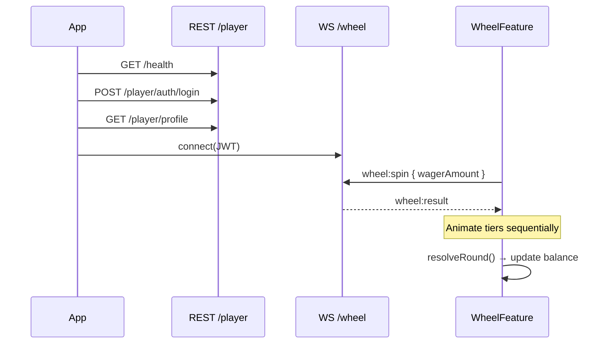

# @spiny-wheely/frontend

React player client for the spinyWheely wheel game. Presentation and animation only — all outcomes and balances are **server-authoritative**.

## Stack

| Layer | Technology |
|-------|------------|
| UI | React 19 |
| Build | Vite 6 |
| State | Zustand |
| Styling | styled-components |
| Real-time | socket.io-client |

## Quick start

From the **monorepo root** (starts API + client):

```bash
docker compose up -d
npm install
cp backend/.env.example backend/.env
npm run migration:run
npm run dev
```

Frontend only:

```bash
npm run dev:web
```

Client: http://localhost:5173

## Environment

Copy `.env.example` → `.env` in this directory.

| Variable | Default | Description |
|----------|---------|-------------|
| `VITE_API_URL` | *(empty in dev)* | API base URL; empty = Vite proxy to `:3000` |
| `VITE_PLAYER_EMAIL` | `player@spinywheely.test` | Dev auto-login email |
| `VITE_PLAYER_PASSWORD` | `player123` | Dev auto-login password |

In production, set `VITE_API_URL` to the public API origin (e.g. `https://api.example.com`).

## Project layout

```
src/
├── features/wheel/
│   ├── WheelFeature.tsx      # Main game screen, tier animations
│   ├── components/
│   │   ├── BetPanel.tsx      # Wager input + spin button
│   │   └── WheelContainer.tsx
│   └── types.ts              # SpinResult, WheelTier
├── core/
│   ├── network/
│   │   ├── api.ts            # REST — login, profile
│   │   ├── socket.ts         # WheelSocketClient
│   │   └── config.ts         # API / WS URL resolution
│   └── store/
│       └── playerStore.ts    # balance, wager, round state
├── shared/styles/
├── assets/                   # Wheel ring images, backgrounds
├── App.tsx                   # Bootstrap: health → login → socket
└── main.tsx
```

## How it connects to the backend

### Development

Vite proxies API traffic to `http://127.0.0.1:3000` (`vite.config.ts`):

- `/health`, `/player/*`, `/admin/*` → REST
- `/socket.io` → WebSocket upgrade

Wheel socket URL resolves to `/wheel` (same origin through the proxy).

### Production

`VITE_API_URL` points both REST (`api.ts`) and Socket.IO (`socket.ts`) at the API host.

## Player flow



### Balance UX rules

- Balance updates in **`resolveRound()`** when the animation finishes — not when the socket message arrives.
- Spin button re-enables after animation via **`failRound()`** / **`resolveRound()`**.
- `isRoundActive` blocks duplicate spins during animation.

## WebSocket events

Uses `WheelSocketClient` (`core/network/socket.ts`):

| Outbound | Inbound |
|----------|---------|
| `wheel:spin` | `wheel:result` |
| `wheel:preview` | `wheel:preview` |
| | `wheel:error` |

## Scripts

```bash
npm run dev      # Vite dev server :5173
npm run build    # Production bundle → dist/
npm run preview  # Preview production build
npm run lint     # ESLint
```

From monorepo root: `npm run dev:web`, `npm run build:web`.

## Architecture

System-wide diagrams: [docs/ARCHITECTURE.md](../docs/ARCHITECTURE.md).  
Backend API reference: [backend/README.md](../backend/README.md).
